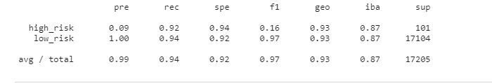

# Credit_Risk_Analysis

Credit risk is an inherently unbalanced classification problem, as good loans easily outnumber risky loans. We will need to employ differene techniques to train and evaluate models. Jill asked us to use imbalanced-lear and scikit-learn. 

We will use RandmonOverSampler, SMOTE, ClusterCentroids, SMOTEEN (combination of over and undersampling). Then to reduce the bias we will use to new machine learning models :
BalancedRandomForestClassifier and EasyEnsembleClassifier. 

# Results

## Naive Random Oversampling

- Balanced Accuracy
  - 0.653370122442553

## SMOTE Oversampling

- Balanced Accuracy
  - 0.6584476794265021
  

## Undersampling

- Balanced Accuracy
  - 0.5474424371810427
  

## SMOTEEN 

- Balanced Accuracy
  - 0.6484827242078745

## Random Forest
- Balanced Accuracy
  - 0.7885466545953005
  

## Easy Ensemble AdaBoost Classifier

- Balanced Accuracy
  - 0.9316600714093861
  
 

All the models scored high on low risk.

